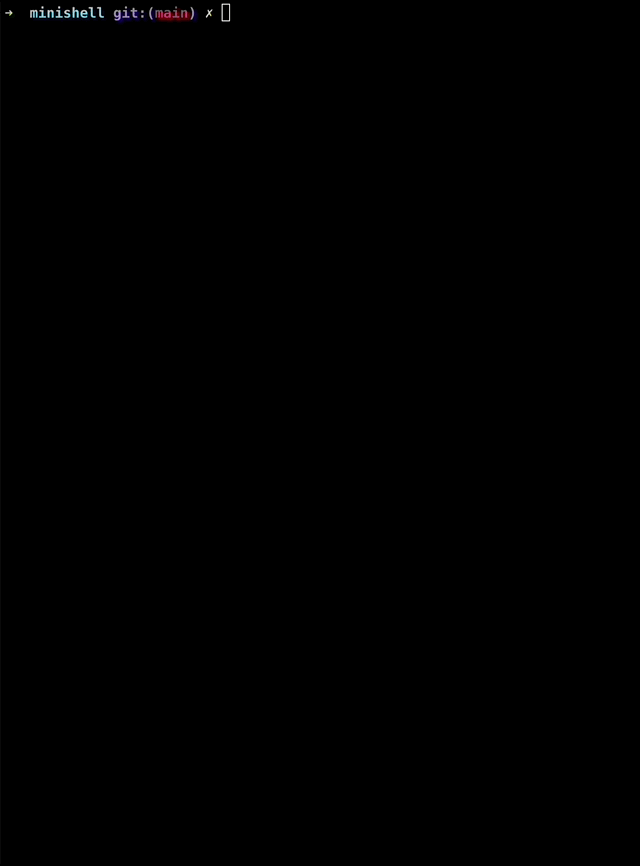

# Minishell

<div style="display" align="center">

</div>

## About

This project we are presenting is a minishell, a command-line program that allows the user to execute system commands. The goal of this project was to recreate the features of a Unix terminal, by implementing the main commands such as cd, echo, ls, pwd, etc. The minishell was developed in C language and uses system calls to communicate with the operating system. This project was carried out in collaboration with a fellow classmate and allowed us to deepen our knowledge in system programming and to better understand the workings of a terminal.

The minishell we present is a command-line program with the following features:

### Redirection
- `<` redirects input.
- `>` redirects output.
- `<<` receives a delimiter and reads input until it encounters a line containing that delimiter.
- `>>` redirects output in append mode.

### Pipe
- Implementation of pipes (`|`). The output of each command in the pipeline is connected to the input of the next command using a pipe.

### Environment variables
- Management of environment variables (a `$` followed by a sequence of characters) which must be replaced by their content.

### Return value
- Management of `$?` which must be replaced by the exit status of the last pipeline executed in the foreground.

### Signals
- Management of `ctrl-C`, `ctrl-D`, and `ctrl-\` which should work like in bash.
- In interactive mode:
  - `ctrl-C` displays a new prompt on a new line.
  - `ctrl-D` exits the shell.
  - `ctrl-\` does nothing.

### Builtins
- `echo` with the `-n` option.
- `cd` only with a relative or absolute path.
- `pwd` with no options.
- `export` with no options.
- `unset` with no options.
- `env` with no options or arguments.
- `exit` with no options.

## Prerequisites
To run this project, you need to have `readline` installed on your machine. If you don't have it installed already, you can install it using the following command on macOS:

```bash
brew install readline
```

Once the installation is complete, you can retrieve the path to `readline` using this command:

```bash
brew --prefix readline
> /opt/homebrew/opt/readline (example)
```

Next, set the `PATH_TO_READLINE` variable in the `Makefile` at line 123 to the path you retrieved.

## Getting Started

First, clone the repository:

````bash
git clone git@github.com:ltrinchini/Minishell.git && cd Minishell
````

Then, compile the program by running:
````bash
make
````

## Usage
Simply run it with :
````bash
./minishell
````

## Credit
This two-person project was done with [Martin ❤️ ](https://github.com/skippydgw42)
